# ether-parent

**Group ID:** `dev.rafex.ether.parent`
**Artifact ID:** `ether-parent`
**Packaging:** `pom`
**License:** MIT

`ether-parent` is the root Maven POM and Bill of Materials (BOM) for the entire ether ecosystem. It centralises dependency version management, plugin configuration, compiler settings, and publishing infrastructure so that every ether module — and your own projects — can inherit or import a consistent, pre-validated set of versions without repeating version numbers everywhere.

---

## Table of Contents

1. [What is it and why do you need it?](#what-is-it-and-why-do-you-need-it)
2. [Module tree](#module-tree)
3. [Using it as a parent POM](#using-it-as-a-parent-pom)
4. [Using it as a BOM (import scope)](#using-it-as-a-bom-import-scope)
5. [Managed dependency versions](#managed-dependency-versions)
6. [Managed build plugins](#managed-build-plugins)
7. [Java 25 enforcement](#java-25-enforcement)
8. [Publishing to Maven Central](#publishing-to-maven-central)
9. [License header management](#license-header-management)
10. [Frequently asked questions](#frequently-asked-questions)

---

## What is it and why do you need it?

Java microservice projects accumulate a long list of library versions that must stay compatible with each other. When you have multiple modules — each defining their own versions — a single upgrade to Jackson or Jetty requires changing dozens of files, and version drift becomes inevitable.

`ether-parent` solves this with two complementary mechanisms:

- **Parent POM inheritance** — your module declares `<parent>`, and Maven inherits all plugin configuration, compiler settings, and `<dependencyManagement>` entries automatically.
- **BOM import** — if you already have a corporate parent you cannot change, you declare `ether-parent` in your `<dependencyManagement>` block with `<scope>import</scope>`, and only the version constraints flow in without touching your existing parent chain.

Both modes give you:

- Java 25 as the compile/release target
- UTF-8 encoding for all sources and reports
- Pre-configured `maven-compiler-plugin`, `maven-surefire-plugin`, `maven-source-plugin`, `maven-javadoc-plugin`
- A single place to bump Jackson, Jetty, or JUnit across the whole tree
- Optional `central-publishing-maven-plugin` and `license-maven-plugin` support through a `deploy` profile

---

## Module tree

The diagram below shows how `ether-parent` sits at the root of the ether module hierarchy. Every box below it inherits or imports dependency management from it.

```mermaid
graph TD
    P["ether-parent\n(BOM + parent POM)"]

    P --> CFG["ether-config\nTyped configuration"]
    P --> CRYPTO["ether-crypto\nCrypto primitives"]
    P --> JSON["ether-json\nJSON codec"]
    P --> JWT["ether-jwt\nJWT issue/verify"]
    P --> DB["ether-database-core\nDatabase abstraction"]
    P --> DBPG["ether-database-postgres\nPostgreSQL support"]
    P --> JDBC["ether-jdbc\nJDBC utilities"]
    P --> OBS["ether-observability-core\nMetrics/tracing"]
    P --> HTTPC["ether-http-core\nHTTP abstractions"]
    P --> HTTPS["ether-http-security\nHTTP security"]
    P --> HTTPP["ether-http-problem\nRFC 9457 problems"]
    P --> HTTPO["ether-http-openapi\nOpenAPI support"]
    P --> HTTPCL["ether-http-client\nHTTP client"]
    P --> HTTPJ["ether-http-jetty12\nJetty 12 server"]
    P --> WSC["ether-websocket-core\nWebSocket abstractions"]
    P --> WSJ["ether-websocket-jetty12\nJetty 12 WebSocket"]
    P --> WH["ether-webhook\nWebhook support"]
    P --> GL["ether-glowroot-jetty12\nGlowroot APM"]
```



---

## Using it as a parent POM

This is the recommended approach for modules that are fully part of the ether ecosystem or for greenfield projects that have no pre-existing parent constraint.

```xml
<!-- pom.xml of your project -->
<project>
    <modelVersion>4.0.0</modelVersion>

    <parent>
        <groupId>dev.rafex.ether.parent</groupId>
        <artifactId>ether-parent</artifactId>
        <version>9.0.0-SNAPSHOT</version>
    </parent>

    <groupId>com.example</groupId>
    <artifactId>my-service</artifactId>
    <version>1.0.0-SNAPSHOT</version>
    <packaging>jar</packaging>

    <dependencies>
        <!-- Version is managed by ether-parent — no <version> needed here -->
        <dependency>
            <groupId>dev.rafex.ether.json</groupId>
            <artifactId>ether-json</artifactId>
        </dependency>
        <dependency>
            <groupId>dev.rafex.ether.jwt</groupId>
            <artifactId>ether-jwt</artifactId>
        </dependency>
        <dependency>
            <groupId>com.fasterxml.jackson.core</groupId>
            <artifactId>jackson-databind</artifactId>
        </dependency>
        <dependency>
            <groupId>org.junit.jupiter</groupId>
            <artifactId>junit-jupiter</artifactId>
            <scope>test</scope>
        </dependency>
    </dependencies>
</project>
```

With the parent in place, you get:

- Java 25 compiler settings with no `<source>` or `<target>` to repeat.
- `maven-surefire-plugin` wired to run JUnit 5 tests automatically.
- `maven-source-plugin` attaching source JARs on every build.
- `maven-javadoc-plugin` generating Javadoc JARs with `doclint:none` so strict Javadoc linting does not break the build.

### Multi-module project example

```xml
<!-- Parent aggregator pom.xml -->
<project>
    <modelVersion>4.0.0</modelVersion>

    <parent>
        <groupId>dev.rafex.ether.parent</groupId>
        <artifactId>ether-parent</artifactId>
        <version>9.0.0-SNAPSHOT</version>
    </parent>

    <groupId>com.example</groupId>
    <artifactId>my-platform</artifactId>
    <version>1.0.0-SNAPSHOT</version>
    <packaging>pom</packaging>

    <modules>
        <module>my-auth-service</module>
        <module>my-catalog-service</module>
        <module>my-gateway</module>
    </modules>
</project>
```

Each child module then has access to all managed versions without repeating them.

---

## Using it as a BOM (import scope)

If your project already extends a corporate or framework parent and you cannot change the inheritance chain, import `ether-parent` as a BOM inside `<dependencyManagement>`. Only the version constraints are imported — nothing about plugins or compiler settings changes.

```xml
<dependencyManagement>
    <dependencies>

        <!-- Import ether-parent as a BOM -->
        <dependency>
            <groupId>dev.rafex.ether.parent</groupId>
            <artifactId>ether-parent</artifactId>
            <version>9.0.0-SNAPSHOT</version>
            <type>pom</type>
            <scope>import</scope>
        </dependency>

    </dependencies>
</dependencyManagement>

<dependencies>
    <!-- Versions resolved from the imported BOM — no <version> needed -->
    <dependency>
        <groupId>dev.rafex.ether.config</groupId>
        <artifactId>ether-config</artifactId>
    </dependency>
    <dependency>
        <groupId>dev.rafex.ether.json</groupId>
        <artifactId>ether-json</artifactId>
    </dependency>
    <dependency>
        <groupId>com.fasterxml.jackson.core</groupId>
        <artifactId>jackson-databind</artifactId>
    </dependency>
    <dependency>
        <groupId>org.eclipse.jetty</groupId>
        <artifactId>jetty-server</artifactId>
    </dependency>
</dependencies>
```

You can combine multiple BOMs. Maven processes them left-to-right; the first declaration wins.

```xml
<dependencyManagement>
    <dependencies>
        <!-- ether BOM takes precedence -->
        <dependency>
            <groupId>dev.rafex.ether.parent</groupId>
            <artifactId>ether-parent</artifactId>
            <version>9.0.0-SNAPSHOT</version>
            <type>pom</type>
            <scope>import</scope>
        </dependency>
        <!-- Corporate BOM fills in anything ether does not cover -->
        <dependency>
            <groupId>com.example.corp</groupId>
            <artifactId>corp-bom</artifactId>
            <version>5.2.0</version>
            <type>pom</type>
            <scope>import</scope>
        </dependency>
    </dependencies>
</dependencyManagement>
```

---

## Managed dependency versions

The table below lists all third-party and ether dependencies whose versions are locked by `ether-parent`. You never need to specify these versions explicitly in child POMs or BOM consumers.

| Group / Artifact | Managed version |
|---|---|
| `com.fasterxml.jackson` (BOM, all Jackson modules) | 2.19.4 |
| `org.junit` JUnit 5 BOM | 5.13.4 |
| `org.eclipse.jetty:jetty-server` | 12.1.6 |
| `org.eclipse.jetty.websocket:jetty-websocket-jetty-api` | 12.1.6 |
| `org.eclipse.jetty.websocket:jetty-websocket-jetty-server` | 12.1.6 |
| `com.google.inject:guice` | 7.0.0 |
| `com.networknt:json-schema-validator` | 1.5.9 |
| `jakarta.mail:jakarta.mail-api` | 2.1.5 |
| `org.apache.commons:commons-lang3` | 3.18.0 |
| `io.netty:netty-codec-http` | 4.1.131.Final |
| `io.netty:netty-handler` | 4.1.131.Final |
| `org.glowroot:glowroot-agent-api` | 0.14.0-beta.3 |
| `dev.rafex.ether.config:ether-config` | 9.0.0-SNAPSHOT |
| `dev.rafex.ether.crypto:ether-crypto` | 9.0.0-SNAPSHOT |
| `dev.rafex.ether.json:ether-json` | 9.0.0-SNAPSHOT |
| `dev.rafex.ether.jwt:ether-jwt` | 9.0.0-SNAPSHOT |
| `dev.rafex.ether.database:ether-database-core` | 9.0.0-SNAPSHOT |
| `dev.rafex.ether.database:ether-database-postgres` | 9.0.0-SNAPSHOT |
| `dev.rafex.ether.jdbc:ether-jdbc` | 9.0.0-SNAPSHOT |
| `dev.rafex.ether.observability:ether-observability-core` | 9.0.0-SNAPSHOT |
| `dev.rafex.ether.http:ether-http-core` | 9.0.0-SNAPSHOT |
| `dev.rafex.ether.http:ether-http-security` | 9.0.0-SNAPSHOT |
| `dev.rafex.ether.http:ether-http-problem` | 9.0.0-SNAPSHOT |
| `dev.rafex.ether.http:ether-http-openapi` | 9.0.0-SNAPSHOT |
| `dev.rafex.ether.http:ether-http-client` | 9.0.0-SNAPSHOT |
| `dev.rafex.ether.http:ether-http-jetty12` | 9.0.0-SNAPSHOT |
| `dev.rafex.ether.websocket:ether-websocket-core` | 9.0.0-SNAPSHOT |
| `dev.rafex.ether.websocket:ether-websocket-jetty12` | 9.0.0-SNAPSHOT |
| `dev.rafex.ether.webhook:ether-webhook` | 9.0.0-SNAPSHOT |
| `dev.rafex.ether.glowroot:ether-glowroot-jetty12` | 9.0.0-SNAPSHOT |

---

## Managed build plugins

`ether-parent` locks and pre-configures the versions of the following Maven plugins via `<pluginManagement>`. Child modules can activate them in `<build><plugins>` without repeating versions.

| Plugin | Version | Notes |
|---|---|---|
| `maven-compiler-plugin` | 3.15.0 | Source/target/release all set to Java 25 |
| `maven-surefire-plugin` | 3.5.5 | JUnit 5 auto-detected; no additional config needed |
| `maven-jar-plugin` | 3.5.0 | |
| `maven-source-plugin` | 3.4.0 | `attach-sources` goal bound to `package` |
| `maven-javadoc-plugin` | 3.12.0 | `doclint:none`, `quiet:true`, `failOnWarnings:false` |
| `maven-install-plugin` | 3.1.4 | |
| `maven-deploy-plugin` | 3.1.4 | |
| `maven-clean-plugin` | 3.5.0 | |
| `maven-resources-plugin` | 3.5.0 | |
| `maven-site-plugin` | 4.0.0-M16 | |
| `maven-enforcer-plugin` | 3.6.2 | Enforces Java 25 minimum JDK |
| `maven-gpg-plugin` | 3.2.8 | GPG artifact signing (deploy profile) |
| `maven-release-plugin` | 3.3.1 | Tag format `v@{project.version}`, auto-push commits |
| `central-publishing-maven-plugin` | 0.10.0 | Sonatype Central publishing, waits until published |
| `license-maven-plugin` | 2.7.1 | MIT header on all Java sources |
| `versions-maven-plugin` | 2.21.0 | Dependency update reports |

---

## Java 25 enforcement

`ether-parent` configures the `maven-enforcer-plugin` to reject builds running on a JDK older than 25. This fires during the `validate` phase — the very first phase Maven executes — so you get a clear failure message before any compilation begins.

```xml
<!-- Already in ether-parent's pluginManagement; shown here for reference -->
<plugin>
    <groupId>org.apache.maven.plugins</groupId>
    <artifactId>maven-enforcer-plugin</artifactId>
    <executions>
        <execution>
            <id>enforce-java</id>
            <goals><goal>enforce</goal></goals>
            <configuration>
                <rules>
                    <requireJavaVersion>
                        <version>25</version>
                    </requireJavaVersion>
                </rules>
            </configuration>
        </execution>
    </executions>
</plugin>
```

If you run `mvn validate` on a JDK 17 machine, Maven prints:

```
[ERROR] Rule 0: org.apache.maven.enforcer.rules.version.RequireJavaVersion failed with message:
Detected JDK Version 17.0.x is not in the allowed range [25,).
```

---

## Publishing to Maven Central

Publishing to Maven Central requires the `deploy` Maven profile. Activate it with `-Pdeploy` when running `mvn deploy`. The profile enables:

1. **GPG signing** via `maven-gpg-plugin` — signs every artifact with your key. Provide the passphrase as `-Dgpg.passphrase=...` or configure it in `~/.m2/settings.xml`.
2. **Central publishing** via `central-publishing-maven-plugin` — bundles and uploads the signed artifacts and waits until the Sonatype Central portal confirms publication.

```bash
# Build, sign, and publish
mvn clean deploy -Pdeploy -Dgpg.passphrase=YOUR_PASSPHRASE
```

Required `~/.m2/settings.xml` entry:

```xml
<servers>
    <server>
        <id>central</id>
        <username>your-sonatype-central-token-username</username>
        <password>your-sonatype-central-token-password</password>
    </server>
</servers>
```

The `central.waitUntil` property defaults to `published`, which means the Maven build does not return until the artifact is fully available on Maven Central.

---

## License header management

The `license-maven-plugin` is bound to `generate-sources` and `process-sources` and automatically prepends the MIT license header to every `.java` file under `src/main/java` and `src/test/java`. The `validate` phase checks that all headers are present.

```bash
# Add or update headers across all Java sources
mvn license:update-file-header

# Check headers only (useful as a CI gate)
mvn license:check-file-header
```

The generated header block looks like this:

```java
/*-
 * #%L
 * my-module
 * %%
 * Copyright (C) 2025 Raúl Eduardo González Argote
 * %%
 * Permission is hereby granted, free of charge, to any person obtaining a copy
 * of this software and associated documentation files (the "Software"), to deal
 * in the Software without restriction ...
 * #L%
 */
```

Files under `**/generated/**` and `**/target/**` are excluded automatically.

---

## Frequently asked questions

**Can I override a managed version in a child module?**

Yes. Declare the artifact again in a `<dependencyManagement>` block inside the child POM. Maven uses the child's declaration over the parent's for that specific artifact.

```xml
<!-- In child pom.xml — override Jackson to a newer snapshot -->
<dependencyManagement>
    <dependencies>
        <dependency>
            <groupId>com.fasterxml.jackson</groupId>
            <artifactId>jackson-bom</artifactId>
            <version>2.20.0-SNAPSHOT</version>
            <type>pom</type>
            <scope>import</scope>
        </dependency>
    </dependencies>
</dependencyManagement>
```

**Can I use a stable release instead of a SNAPSHOT?**

Published releases of `ether-parent` are available on Maven Central under the same coordinates. Replace `9.0.0-SNAPSHOT` with the latest stable version.

**Does using `ether-parent` as a BOM affect my plugin configuration?**

No. BOM import (`<scope>import</scope>`) only imports `<dependencyManagement>` entries. Plugin management and properties are not inherited — those require parent POM inheritance.

**How do I check which dependency updates are available?**

```bash
mvn versions:display-dependency-updates
mvn versions:display-plugin-updates
```

**What is the difference between `parent` and `import`?**

| Feature | `<parent>` | `<scope>import</scope>` |
|---|---|---|
| Dependency version management | Inherited | Imported |
| Plugin management | Inherited | Not imported |
| Compiler settings | Inherited | Not imported |
| Multiple inheritance | Not possible | Stack multiple BOMs |
| Requires modifying parent | Yes | No |
